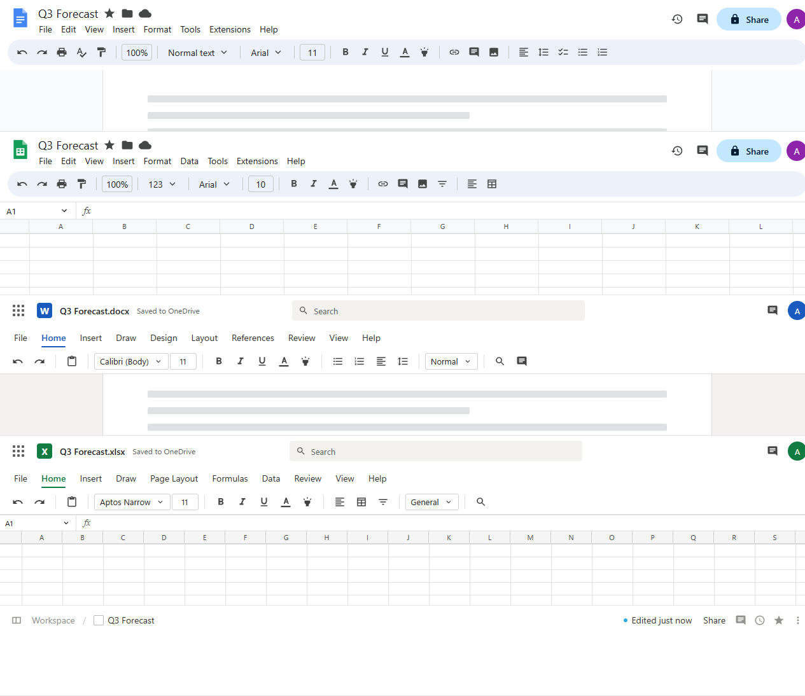
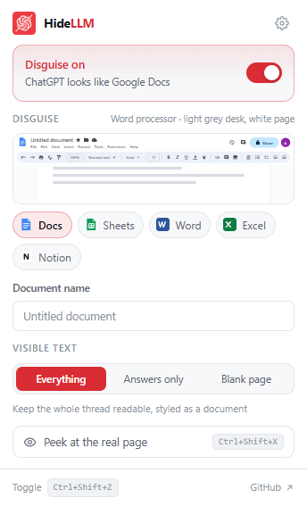

<div align="center">


# HideLLM

**Your AI assistant, wearing a suit.**

A Chrome extension that makes ChatGPT, Claude, Gemini and others look like an
ordinary work document, so a glance at your screen shows a spreadsheet, not a chatbot.

No account. No servers. No network requests of any kind.

[](https://github.com/antidepressive/HideLLM/actions/workflows/ci.yml)
[](https://github.com/antidepressive/HideLLM/releases/latest)
[](manifest.json)
[](package.json)
[](LICENSE)

[Install](#install) · [How it works](#how-it-works) · [Settings](#settings) · [Architecture](docs/ARCHITECTURE.md) · [Contributing](CONTRIBUTING.md)

</div>



<sub>The five disguises, rendered by the extension itself. This image is a screenshot of the actual output, not a mock-up.</sub>

---

## What it does

Flip the switch and the page is restyled where it stands. The chat interface is
hidden, the colours and type are flattened into document body text, the tab title
and favicon change, and a **rendered** application toolbar is drawn across the top.

Rendered, not screenshotted: the toolbar is real HTML and CSS at exact pixel
sizes, so it matches the app it's imitating at any window width, any zoom level and
any display density, and stays sharp instead of looking blown up.

| | |
|---|---|
| **Disguises** | Google Docs · Google Sheets · Microsoft Word · Microsoft Excel · Notion |
| **Sites** | ChatGPT · Claude · Gemini · Grok\* · Perplexity\* · DeepSeek\* · Copilot\* |
| **Visible text** | Everything · Answers only · Blank page |
| **Document name** | Anything you like; it drives the toolbar *and* the tab title |
| **Toggle** | `Ctrl+Shift+Z`, from any tab |
| **Peek** | `Ctrl+Shift+X` reveals the real page, and auto-hides after 15s |

<sub>\* experimental: these use generic rules rather than hand-tuned ones, and may not hide everything.</sub>

The disguise survives navigation and reloads, and re-asserts itself against the
sites' own scripts when they try to put their title and icon back.

## Install

There is no build step. The code in this repository *is* what runs.

1. Grab the [latest release zip](https://github.com/antidepressive/HideLLM/releases/latest)
   and unzip it, or `git clone` this repository, which is the same code.
2. Open `chrome://extensions`.
3. Turn on **Developer mode**, top right.
4. Click **Load unpacked** and choose the folder containing `manifest.json`.
5. Pin HideLLM from the puzzle-piece menu so the toolbar icon is visible.

Open an assistant, click the icon, flip the switch. Works in Chrome, Edge, Brave,
Arc, Opera and anything else built on Chromium 102+.

## How it works

Three things get injected into the tab, and nothing else ever runs:

1. **A stylesheet** that flattens the site's colours, hides its interface, and
   paints a document canvas onto the page: a centred white page on a grey desk for
   Docs and Word, a live cell grid for Sheets and Excel.
2. **The toolbar**, mounted in a *shadow root*. That's what keeps it looking like
   Google Docs while the stylesheet is busy flattening every colour on the page
   around it: outer CSS cannot reach into a shadow tree.
3. **The tab title and favicon**, re-asserted by a `MutationObserver` because
   these apps rewrite both on every route change.

Nothing is injected until you switch it on. There is no content script, so on a
fresh install the extension is inert.

## Settings



The popup covers the everyday controls. Everything else is on the options page
(the cog, top right).

**Visible text** decides how much of the conversation stays readable:

| Mode | What you see |
|---|---|
| **Everything** *(default)* | The full thread, typeset as a document |
| **Answers only** | Your prompts are hidden; the replies remain, styled as document body text |
| **Blank page** | The whole conversation is hidden, leaving an empty document |

**Document name** flows into both the fake toolbar and the tab title, formatted the
way each app does it: `Q3 Forecast` becomes *Q3 Forecast - Google Docs* under Docs
and *Q3 Forecast - Word* under Word. There's a separate override on the options page
if you want the tab to say something else entirely.

**Peek** (`Ctrl+Shift+X`) drops the disguise on the tab in front so you can read,
then puts it back on a timer. Set the timer to `0` to keep it revealed until you
press the key again.

**Sites** can be switched off individually, which is useful for turning off the
experimental ones, or for a site where you don't want the extension active at all.

<br clear="right">


## Privacy

**The extension makes no network requests.** There is no backend, no analytics and
no telemetry. There is no `fetch` call in the source, and [a test asserts
that](test/worker.test.js) on every commit.

- Settings are stored by Chrome (`storage.sync`) and never leave your browser profile.
- Permissions requested: `storage`, `scripting`, `alarms`, plus host access to the
  assistant sites listed above. Nothing else.
- **No web-accessible resources.** Every icon and image is an inline SVG data URI,
  which means a visited page cannot detect the extension by probing for its asset
  URLs, which is a common fingerprinting trick.

Full statement: [PRIVACY.md](PRIVACY.md).

## What it is not

Read this before you rely on it.

- **It is a visual disguise, and only that.** The address bar still says
  `chatgpt.com`. Your history, your network traffic and your account are untouched.
  It defeats someone glancing over your shoulder. It does not defeat someone
  looking properly, and it does not defeat corporate monitoring software.
- **The send button is hidden.** It's a chat control, and chat controls are what
  give the game away. The box you type into stays where it is, in every visible-text
  mode. Press <kbd>Enter</kbd> to send.
- **Selectors rot.** The disguise targets generated class names on sites that ship
  changes weekly. When one breaks, the fix is a few lines in
  [`src/core/sites.js`](src/core/sites.js). Issues and pull requests welcome.
- **Chromium only.** No Firefox or Safari build.

## Development

No build step, no dependencies, no package manager needed to run it.

```bash
npm test        # the full suite, with no install required
npm run lint    # syntax + formatting check
npm run icons   # regenerate the icons from scripts/make-icons.mjs
npm run build   # dist/hidellm-<version>.zip for the Web Store
```

| Changed | To see it |
|---|---|
| `src/core/*`, `src/background.js`, `manifest.json` | Reload the extension at `chrome://extensions` |
| `src/popup/*` | Reopen the popup |
| `src/options/*` | Reload the options tab |

**Adding a disguise** is one entry in `src/core/themes.js`. The popup, the options
page and the settings validator all read that object, so nothing else needs
touching. See [docs/THEMES.md](docs/THEMES.md).

**Adding a site** is one entry in `src/core/sites.js` plus the matching
`host_permissions`; a test fails if those two ever disagree.

[docs/ARCHITECTURE.md](docs/ARCHITECTURE.md) explains the layered stylesheet, the
shadow-root toolbar and the injected-function pattern. Read it before making
structural changes.

## Contributing

Bug reports, selector fixes and new disguises are all welcome. See
[CONTRIBUTING.md](CONTRIBUTING.md); by taking part you agree to the
[Code of Conduct](CODE_OF_CONDUCT.md).

## Licence

[MIT](LICENSE).
